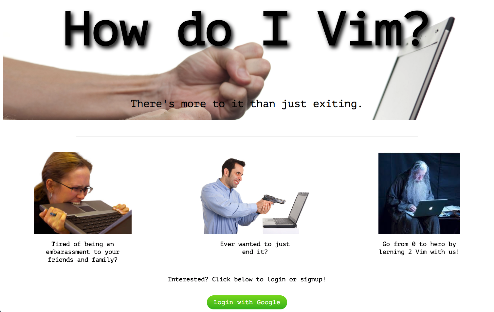
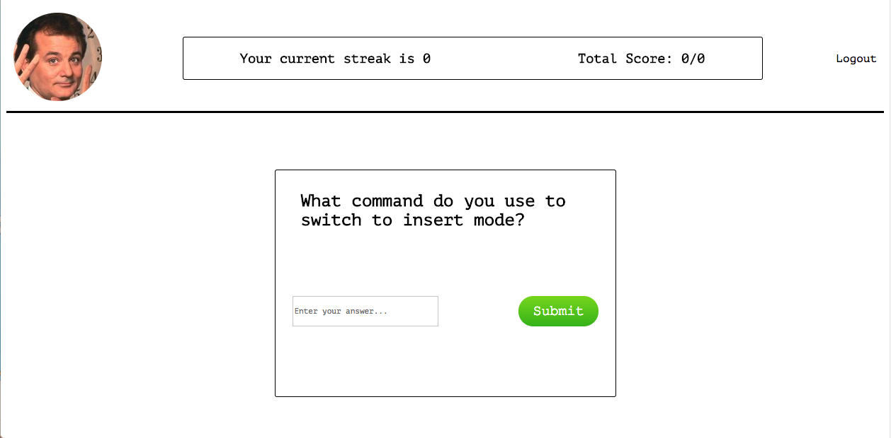

# How Do I Vim?

Have you ever wanted to use the vim text editor but no idea how? This is the app
for you. Using space repetition it will teach you all the commands you will need
to know to easily maneuver through the editor. All you have to do is sign-up/login
with your google email and start learning.

## Technology Used

**FrontEnd**: CSS, JavaScript, React, Redux <br/>
**BackEnd**: NodeJs, Express, MongoDB, Mongoose, Mlab <br/>
**Deployment**: Heroku <br/>

## Documentation of API

**GET** http://young-castle-67864.herokuapp.com/api/auth/logout <br/>
This allows you to logout out of our app with google oAuth <br/>
**GET** http://young-castle-67864.herokuapp.com/api/me <br/>
This allows you to see who is using the app but, is restricted due to google oAuth <br/>
**GET** http://young-castle-67864.herokuapp.com/api/questions <br/>
This allows you to see the list of questions but, is restricted due to google oAuth <br/>

## Run Locally

```sh
$ git clone https://github.com/thinkful-c11/thomas-patrice-spaced-repetition.git
```

```sh
$ cd thomas-patrice-spaced-repetition
```

```sh
$ npm install
```

```sh
$ npm run dev
```
go to `http://localhost:8080` and the app shoud running

* You will need to get google OAuth credentials.
* You should get a Client ID and Secret.
* Back in your project locally, create an `secret.js` file in the `/server` directory:
(Use the client ID and secret we just got from Google)

```js
module.exports = {
  CLIENT_ID: 'yourId123.apps.googleusercontent.com',
  CLIENT_SECRET: 'yoursecret'
}
```

* You will also need to have a local mongo server

## Screenshots
#### Login Screen
 <br/>
#### Questions Page
 <br/>
